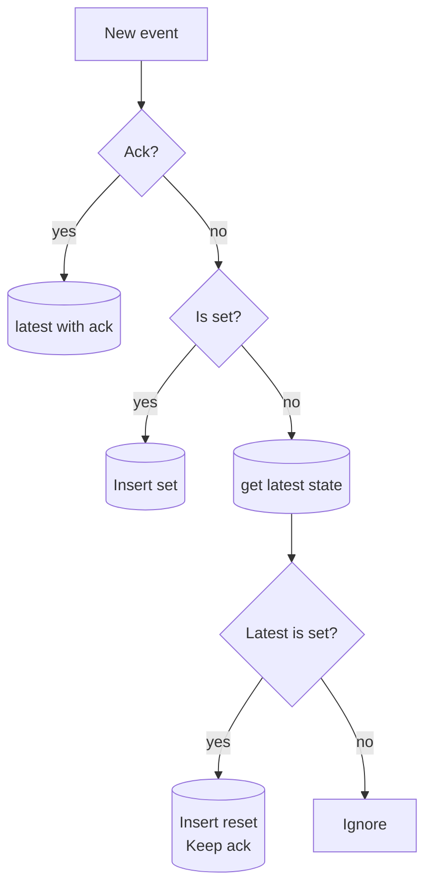

# alarm-server

This server is intended to read measurements from a RabbitMQ server and send alarms over a Websocket to a browser.

## Server

The server is based on Tokio framework. The server uses a simple protocol over Websocket to communicate with the browser. This server is still under development and so far only support a very simple alarm type where it will set the alarm if the meas is equal to the set value. The reset works the same way.

## Client

At [wasm-client](./wasm-client) there is a client that implements this protocol. The client is a simple wrap around the JavaScript websocket that implements the protocol and add extra methods to interact with the server.
The client is written in Rust and compiled to wasm to be imported in the browser.


## Building

Here are a few instruction on how to build both server and client. For now their build is done separately but in the future I'll look for a simpler way to do it.

### Pre requirements
For following the next steps is required to have working installation of rust toolchain. For installing a configuring rust you can follow the instruction on the [official installation page](https://www.rust-lang.org/tools/install)

### Server
To build the server we can simple got to the server folder and build it using cargo

```bash
cd alarm-server
cargo build
```
This will build a debugable version (without optimizations) in <repo_root>/target/debug. If you wan't to build a release version use the following command

```bash
cd alarm-server
cargo build --release
```

the output dir will be in this case <repo_root>/target/release


### Client
To build the client these steps can be followed:

1- Install wasm-pack
```bash
curl https://rustwasm.github.io/wasm-pack/installer/init.sh -sSf | sh
```

2- run wasm-pack from the client folder
```bash
cd wasm-client
wasm-pack build --target web
```

At [index.html](./wasm-client/index.html) There is an example on how to import and use the client


## Running

Besides that it's also needed to have running a RabbitMQ server in order to get the everything working.

So far the expected address of the RabbitMQ is set only on the code itself and the default is localhost:5672.

The alarm configurations is expected to be like [this](./alarm-server/examples/config.yaml) and to be at ./alarm-server/examples/config.yaml. A more detailed documentation on how the alarm should be configured on this file will be made in the future.

The alarm-serve port is also only changeable on the code and the default is 8080.

All this configuration will, in the near future, be configurable using a file. However, for now they need to be changed on the [main.rs](./alarm-server/src/main.rs).

To run the server we can run the build binary or we can let cargo build and run it for us using this:

```bash
cd alarm-server
cargo run
```

For the client all that's needed is to import it on the webpage like this:
```html
<script type="module">
    import init, { AlarmClient } from "./pkg/wasm_client.js";
    let interval;
    let alm_srv
    init().then(
        alm_srv = new AlarmClient(addr);
        alm_srv.set_onopen(function () {
        console.log("ws open");

        // to Keep the connection alive
        interval = setInterval(() => {
          alm_srv.send_keep_alive();
        }, 12000);
      })
    )
</script>
```

A more detailed documentation on how to use the client and all the available methods will be created in the future.

## What's next?

More features are planned. To see the backlog or to add suggestion of features take a look [here](https://github.com/users/mzaniolo/projects/1/views/3?sliceBy%5BcolumnId%5D=)


So far the next steps are:

 - Make unit test
 - Create config file for the server
 - Make alarms more flexible, with more types
 - Add authentication and permissions
 - Replace the server-client string based protocol by something smaller. Possible candidate is [Prost](https://github.com/tokio-rs/prost)


> [!WARNING]
> This is still a work in progress and is yet not production ready
> 

## Alarm flow
This is the flow for evaluating an alarm


